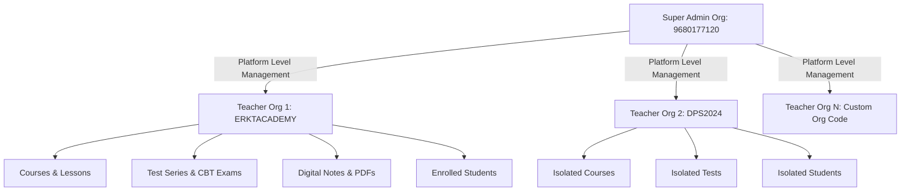

# 🏛️ Architecture & System Design Documentation

## 1. Overview & Tech Stack
**Er. Raju Kumawat Educational Super-Platform** is a high-performance, multi-tenant EdTech operating system built for scalable online education, real-time assessments, interactive course delivery, and mobile learning.

### Core Technology Stack:
- **Framework**: [Next.js 16 (Turbopack)](https://nextjs.org/) with React 19 & TypeScript.
- **Database & ORM**: PostgreSQL hosted on [Supabase](https://supabase.com/) managed through [Prisma ORM 6.11+](https://www.prisma.io/).
- **State Management**: [Zustand](https://github.com/pmndrs/zustand) for global application state, portal views, cart, and student active exams.
- **Styling & UI**: Tailwind CSS v3/v4, Radix UI primitives, Lucide Icons, and Framer Motion micro-animations.
- **Mobile Engine**: [Capacitor 8.4+](https://capacitorjs.com/) for native Android (APK/AAB) and iOS packaging.
- **Authentication**: JWT-based session security with bcrypt password hashing, rate limiting, and brute-force lockouts.

---

## 2. Multi-Tenant Architecture

### Tenant Isolation Model:
1. Every organization has a unique **`id`** (CUID) and an institute **`code`** (e.g., `9680177120` for Platform Super Admin, `ERKTACADEMY` for Er. Raju Kumawat Academy).
2. Data entities (Courses, TestSeries, Tests, Questions, DigitalProducts, Students, Orders, Leads, SupportQueries) are scoped to their parent `organizationId`.
3. `resolveOrgId()` helper dynamically parses the active organization from:
   - Authenticated JWT token
   - Request Headers (`x-org-id` or `x-institute-code`)
   - Query Parameters (`?organizationId=...`)
   - Default Platform fallback (`9680177120`).

---

## 3. Database Connection & Supabase Pooler Strategy

To handle high concurrency while preventing serverless connection starvation:
- **`DATABASE_URL`**: Supabase PgBouncer transaction pooler on port `6543` with `sslmode=require&connection_limit=10&pool_timeout=30`.
- **`DIRECT_URL`**: Direct connection on port `5432` with `sslmode=require` for Prisma migrations and schema push operations.
- **Global Prisma Client Singleton**: Initialized via `src/lib/db.ts` to prevent multiple connection instances in development hot-reloading.

---

## 4. Portals & Application Flow

The system features three seamlessly synchronized portals driven by `useAppStore` in `src/lib/store.ts`:

1. **Super Admin Platform Portal (`admin`)**:
   - Master analytics, revenue commission oversight, institute registration, global announcements, and feature toggle management.
2. **Teacher / Institute CMS Portal (`cms`)**:
   - Course builder with multilingual video translations, CBT exam creator with LaTeX question builder, coupon engine, and student gradebook.
3. **Student Learning Portal (`student`)**:
   - Real-time CBT exam engine with timer, anti-cheat detection, instant score breakdown, interactive video player, and digital note viewer.
